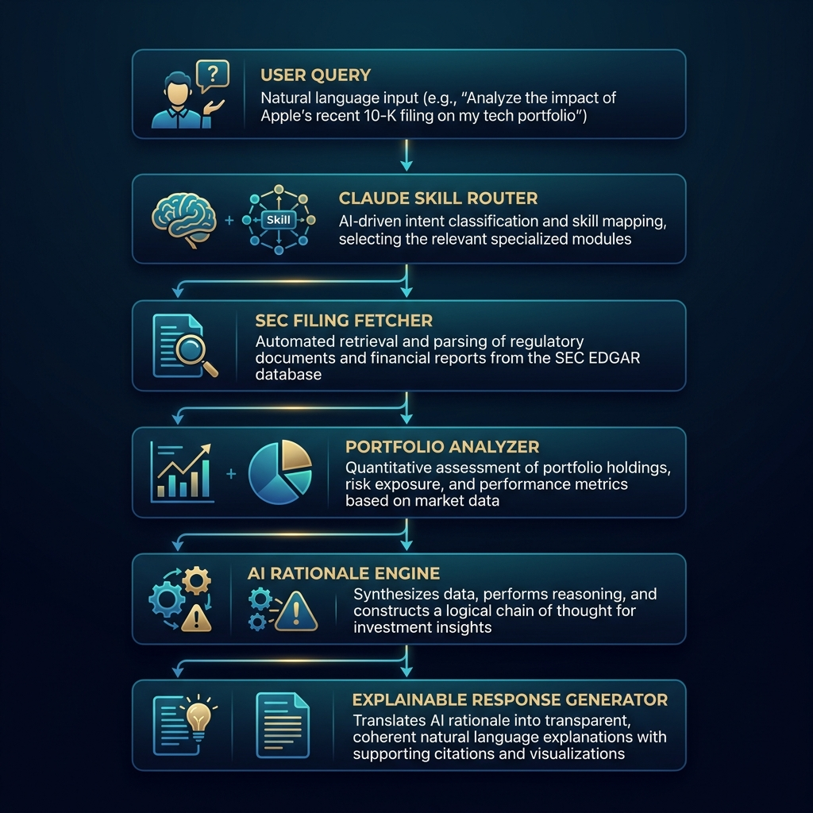

# Institutional Intelligence Skills: Explainable Institutional Portfolio Intelligence Core

[](LICENSE)
[](institutional_intelligence_skills_research_document.md)
[](skills/)

Welcome to **Institutional Intelligence Skills**, an open-source Explainable AI (XAI) framework built on the **Claude Skills** architecture. Authored by **Rignesh P**, this repository bridges the informational gap between institutional investment giants and independent market researchers by transforming dense, retroactive regulatory filings into structured, macro-contextualized portfolio intelligence.

---

## 🏛️ Supported Institutions

The framework is engineered to support a diverse cohort of global institutional asset managers, categorizing them by investment philosophy:

| **Investment Banks** | **Asset Managers** | **Hedge Funds** | **Conglomerates** |
| :--- | :--- | :--- | :--- |
| • JPMorgan Chase<br>• Citigroup<br>• Goldman Sachs | • BlackRock<br>• Vanguard | • Citadel<br>• Bridgewater<br>• Pershing Square<br>• Renaissance Technologies<br>• Two Sigma | • Berkshire Hathaway |

---

## 📖 Research Foundation

The mathematical models, empirical evaluations, and cognitive frameworks backing this technology are detailed in the accompanying research paper:
👉 **[Institutional Intelligence Skills Research Paper](institutional_intelligence_skills_research_document.md)**

This research introduces a scientific empirical framework using:
- **Independent Variables (IV)**: Explanation Reasoning Paradigms, Macroeconomic Contextualization Depths, and Input Temporal Granularities.
- **Dependent Variables (DV)**: User Comprehension Scores ($\Delta_c$), Calibrated Trust Indices ($T_c$), Downstream Actionability Utility ($U_a$), and Strategic Rationale Strategic Fidelity ($F_s$).
- **Control Variables (CV)**: User Financial Sophistication, Institutional Strategy Archetypes, Baseline Market Regimes, and Model Architectures.

---

## 🎨 Research & Architecture Visualizations

### Conceptual Research Framework (Figure 1)


### Technical System Architecture (Figure 2)


### Portfolio Sector Allocation Comparison (Figure 3)


### Sequential Query Execution Pipeline (Figure 4)


---

## 🛠️ Claude Skills Core

This repository is engineered as a **Claude Skills-only repository**, containing 5 decoupled, enterprise-grade analytical skills. Each skill is packaged in a self-contained directory containing its isolated `SKILL.md` instruction file:

| Reusable Claude Skill | Location | Analytical Purpose |
| :--- | :--- | :--- |
| **Institution Portfolio Analyzer** | [`skills/institution-portfolio-analyzer/SKILL.md`](skills/institution-portfolio-analyzer/SKILL.md) | Parses raw 13F holdings, aggregates standardized sectors, and evaluates Herfindahl-Hirschman Index (HHI) concentration scores. |
| **Filing Change Detector** | [`skills/filing-change-detector/SKILL.md`](skills/filing-change-detector/SKILL.md) | Tracks quarter-over-quarter share movements, isolating new, increased, reduced, and liquidated holdings. |
| **Rationale Engine** | [`skills/rationale-engine/SKILL.md`](skills/rationale-engine/SKILL.md) | Synthesizes explainable, probabilistic rationales for portfolio shifts using macroeconomic catalysts. |
| **Market Distribution Mapper** | [`skills/market-distribution-mapper/SKILL.md`](skills/market-distribution-mapper/SKILL.md) | Stratifies assets across market-cap brackets, global domicile geographies, and specific sub-industries. |
| **Institution Comparison Engine** | [`skills/institution-comparison/SKILL.md`](skills/institution-comparison/SKILL.md) | Performs side-by-side structural comparison and divergent sector weight evaluations of two managers. |

---

## 📚 Documentation Portal

To keep the repository clean and readable, detailed instructions and guides have been modularized under the [`docs/`](docs/) folder:

* **[1. Getting Started Guide](docs/getting_started.md)**: Setup prerequisites, library installation (`requests`), and step-by-step instructions on loading skills into Claude.ai Projects.
* **[2. How to Use Guide](docs/how_to_use.md)**: Agentic one-prompt workflows, unified terminal execution (`run.py` CLI script), and our **Input Flexibility (No JSON Required)** guidelines.
* **[3. Prompt Templates Directory](docs/prompt_templates.md)**: A complete, copy-pasteable library of sophisticated conversational chat prompts for all 6 skills.
* **[4. Financial Infrastructure & Resources](docs/financial_infrastructure.md)**: Comprehensive educational breakdowns of SEC Form 13F and the OpenFIGI standard, alongside recommended reference websites for benchmarking.

---

## 📂 Repository Structure

The workspace is strictly partitioned to adhere to the modular **Claude Skills-only repository** architecture:

```txt
institutional-finance-skills/
├── docs/
│   ├── financial_infrastructure.md
│   ├── getting_started.md
│   ├── how_to_use.md
│   └── prompt_templates.md
├── skills/
│   ├── institution-portfolio-analyzer/
│   │   └── SKILL.md
│   ├── filing-change-detector/
│   │   └── SKILL.md
│   ├── market-distribution-mapper/
│   │   └── SKILL.md
│   ├── rationale-engine/
│   │   └── SKILL.md
│   └── institution-comparison/
│       └── SKILL.md
├── assets/
│   ├── conceptual_framework.png
│   ├── system_architecture.png
│   ├── sector_allocation.png
│   └── pipeline_flow.png
├── LICENSE
├── README.md
├── run.py
└── institutional_intelligence_skills_research_document.md
```

---

## ⚖️ License & Disclaimer

This project is licensed under the open-source **MIT License**—see the [`LICENSE`](LICENSE) file for complete details.

### Compliance Disclaimer
The analytical skills and explanations generated within this framework are probabilistic macroeconomic models based on delayed, backward-looking SEC disclosures (Form 13F). This system **does not provide financial advice, active trading commands, or investment predictions**. It is intended solely for academic research and post-hoc strategy interpretation.
