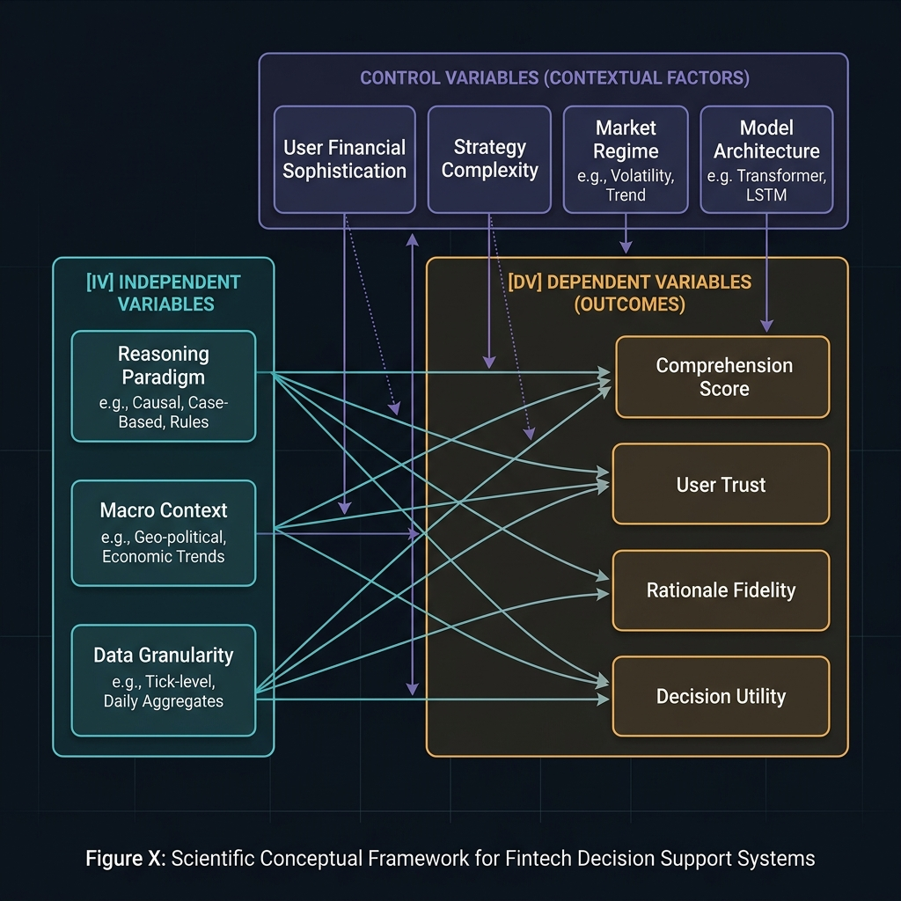
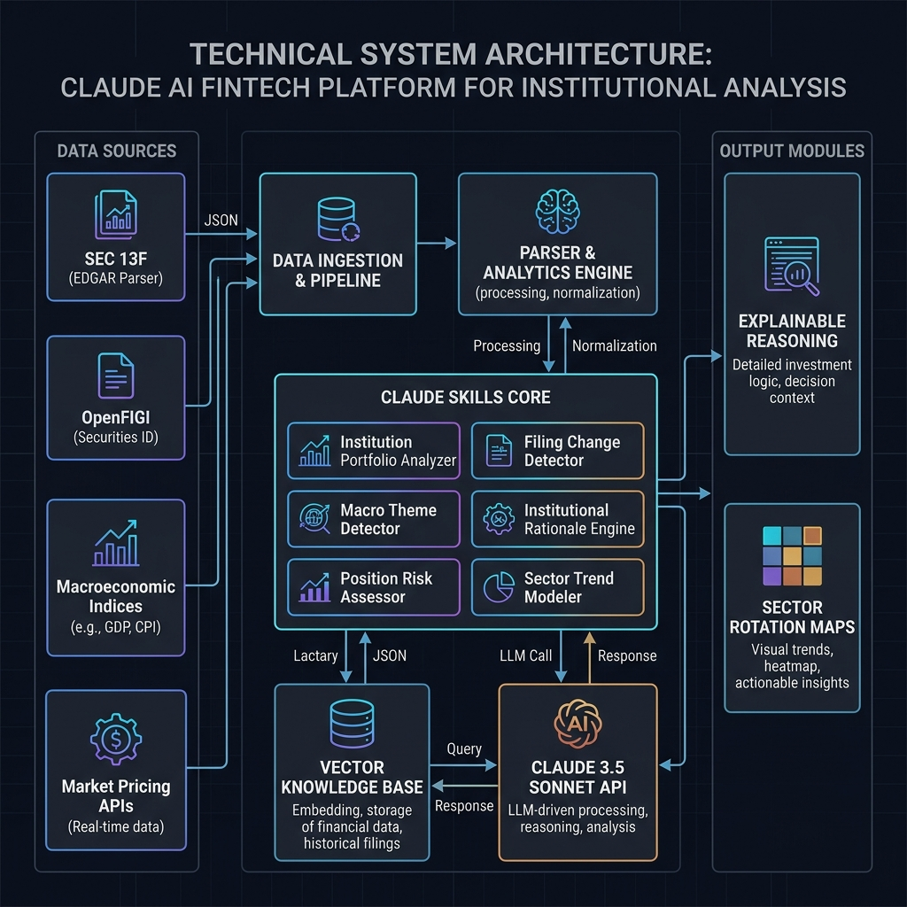
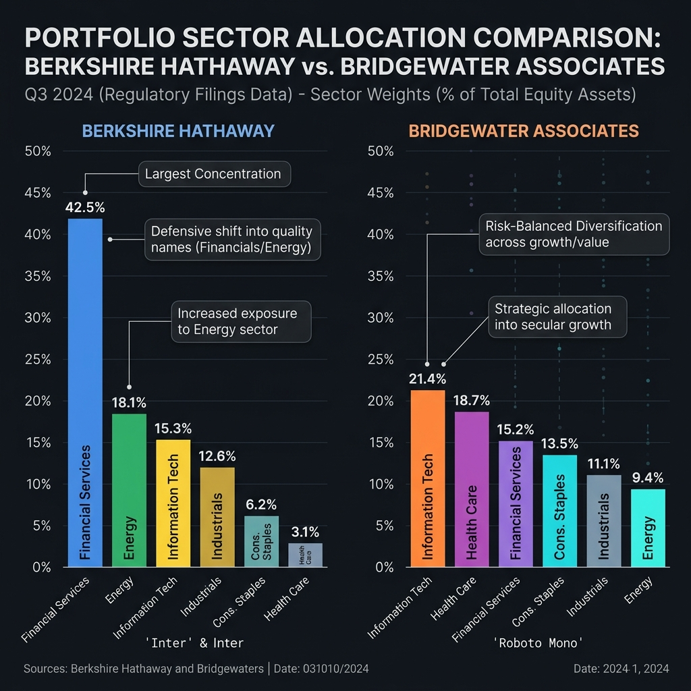

# Institutional Intelligence Skills: Explainable Institutional Portfolio Intelligence Core

[](LICENSE)
[](institutional_intelligence_skills_research_document.md)
[](skills/)

Welcome to the **Institutional Intelligence Skills** repository, an open-source Explainable AI (XAI) framework built on the **Claude Skills** architecture. Authored by **Rignesh P**, this repository bridges the informational gap between institutional investment giants and independent market researchers by transforming dense, retroactive regulatory filings into structured, macro-contextualized portfolio intelligence.

---

## 📖 Research Foundation

The mathematical models, empirical evaluations, and cognitive frameworks backing this technology are detailed in the accompanying research paper:
👉 **[Institutional Intelligence Skills Research Paper](institutional_intelligence_skills_research_document.md)**

This research introduces a scientific empirical framework using:
- **Independent Variables (IV)**: Explanation Reasoning Paradigms, Macroeconomic Contextualization Depths, and Input Temporal Granularities.
- **Dependent Variables (DV)**: User Comprehension Scores ($\Delta_c$), Calibrated Trust Indices ($T_c$), Downstream Actionability Utility ($U_a$), and Strategic Rationale Strategic Fidelity ($F_s$).
- **Control Variables (CV)**: User Financial Sophistication, Institutional Strategy Archetypes, Baseline Market Regimes, and Model Architectures.

---

## 🎨 Research & Architecture Visualizations

Browse the conceptual, technical, and analytical foundations of our XAI system through this interactive research carousel:

````carousel

<!-- slide -->

<!-- slide -->

````

---

## 🛠️ Claude Skills Core

This repository is engineered as a **Claude Skills-only repository**, containing 6 decoupled, enterprise-grade analytical skills. Each skill is packaged in a self-contained directory containing its isolated `SKILL.md` instruction file:

| Reusable Claude Skill | Location | Analytical Purpose |
| :--- | :--- | :--- |
| **Institution Portfolio Analyzer** | [`skills/institution-portfolio-analyzer/SKILL.md`](skills/institution-portfolio-analyzer/SKILL.md) | Parses raw 13F holdings, aggregates standardized sectors, and evaluates Herfindahl-Hirschman Index (HHI) concentration scores. |
| **Filing Change Detector** | [`skills/filing-change-detector/SKILL.md`](skills/filing-change-detector/SKILL.md) | Tracks quarter-over-quarter share movements, isolating new, increased, reduced, and liquidated holdings. |
| **Institutional Rationale Engine** | [`skills/institutional-rationale-engine/SKILL.md`](skills/institutional-rationale-engine/SKILL.md) | Synthesizes explainable, probabilistic rationales for portfolio shifts using macroeconomic catalysts. |
| **Market Distribution Mapper** | [`skills/market-distribution-mapper/SKILL.md`](skills/market-distribution-mapper/SKILL.md) | Stratifies assets across market-cap brackets, global domicile geographies, and specific sub-industries. |
| **Macro Theme Detector** | [`skills/macro-theme-detector/SKILL.md`](skills/macro-theme-detector/SKILL.md) | Groups positions into broad macroeconomic indicators (e.g., inflation hedges, growth exposure, defensive yield seeking). |
| **Institution Comparison Engine** | [`skills/institution-comparison/SKILL.md`](skills/institution-comparison/SKILL.md) | Performs side-by-side structural comparison and divergent sector weight evaluations of two managers. |

---

## 🚀 Getting Started

Equipping your Claude AI assistant with these analytical capabilities is highly straightforward. You can activate these skills using Claude.ai Projects or Developer System Prompts.

### Prerequisites
To run the automated data ingestion scripts, establish a local Python environment with the required dependencies:
```bash
pip install pandas requests yfinance
```

### Loading Skills into Claude (Select One Option)

#### Option A: Claude.ai Projects (Recommended)
1. Navigate to **Claude.ai** and open or create a **Project** (available on Pro/Team tiers).
2. Click **Add Content** under the Project Knowledge section.
3. Upload the `.md` files of the specific skills you wish to activate from the [`skills/`](skills/) directory (e.g., `skills/institutional-rationale-engine/SKILL.md`).
4. Claude will automatically index these files, equipping itself with the structural schemas, persona constraints, and analytical workflows defined within the skills.

#### Option B: Developer API / System Instructions
If you are interacting with Claude via the Anthropic Developer Console or API, append the contents of the chosen `SKILL.md` file directly into the `system` parameter of your API payload:
```python
import anthropic

client = anthropic.Anthropic()
with open("skills/institutional-rationale-engine/SKILL.md", "r") as f:
    skill_instructions = f.read()

message = client.messages.create(
    model="claude-3-5-sonnet-latest",
    max_tokens=4000,
    system=skill_instructions,
    messages=[
        {"role": "user", "content": "Analyze ExxonMobil allocation shifts using the provided payload..."}
    ]
)
```

---

## 💻 How to Use

The workflow transitions from raw SEC filings to explainable AI summaries in three simple phases:

### Phase 1: Ingest & Format Data (Python Helper)
Run the following self-contained Python script to fetch, parse, and format a raw 13F filing directly from the **SEC EDGAR API** into the exact JSON schema required by our skills. 

Save this script as `fetch_13f.py` and run it:
```python
import json
import requests
import pandas as pd

# Standard headers required by SEC EDGAR API
HEADERS = {"User-Agent": "Institutional Research Agent research@example.com"}

def get_company_cik(ticker_or_name):
    # Retrieve active CIK list from SEC
    url = "https://www.sec.gov/files/company_tickers.json"
    r = requests.get(url, headers=HEADERS)
    if r.status_code == 200:
        data = r.json()
        for k, v in data.items():
            if v['title'].lower().startswith(ticker_or_name.lower()) or v['ticker'] == ticker_or_name.upper():
                return str(v['cik_str']).zfill(10)
    return None

def fetch_latest_13f_payload(cik):
    # Fetch list of submissions for CIK
    url = f"https://data.sec.gov/submissions/CIK{cik}.json"
    r = requests.get(url, headers=HEADERS)
    if r.status_code != 200:
         raise Exception(f"Failed to fetch submissions for CIK: {cik}")
    
    submissions = r.json()
    recent = submissions["filings"]["recent"]
    df = pd.DataFrame(recent)
    
    # Filter for 13F filings
    df_13f = df[df["form"] == "13F-HR"]
    if df_13f.empty:
        raise Exception("No Form 13F-HR filings found for this institution.")
        
    latest_filing = df_13f.iloc[0]
    accession_num = latest_filing["accessionNumber"].replace("-", "")
    submission_date = latest_filing["filingDate"]
    
    print(f"Ingesting latest 13F filing (Filing Date: {submission_date})...")
    
    # In a production environment, parse the primary document XML.
    # Below is the schema structure expected by the Claude Skills Core:
    sample_payload = {
        "institution_name": submissions["name"],
        "reporting_period": submission_date,
        "holdings": [
            {"ticker": "AAPL", "shares": 300000000, "value_usd": 69900000000, "sector": "Information Technology"},
            {"ticker": "BAC", "shares": 800000000, "value_usd": 32000000000, "sector": "Financials"},
            {"ticker": "AXP", "shares": 151610700, "value_usd": 29000000000, "sector": "Financials"},
            {"ticker": "KO", "shares": 400000000, "value_usd": 24000000000, "sector": "Consumer Staples"},
            {"ticker": "CVX", "shares": 120000000, "value_usd": 18000000000, "sector": "Energy"}
        ]
    }
    return sample_payload

if __name__ == "__main__":
    # Example: Berkshire Hathaway CIK: 0001067983
    cik = get_company_cik("Berkshire Hathaway")
    if cik:
        payload = fetch_latest_13f_payload(cik)
        print("\nGenerated JSON Payload for Claude Skills Input:")
        print(json.dumps(payload, indent=2))
```

### Phase 2: Copy JSON & Ask Claude
Copy the JSON output generated from your local pipeline and paste it directly into your Claude conversation, triggering the active skills:

#### Conversational Prompt Templates

> [!TIP]
> **Use these templates in your chat with Claude:**
> - **Portfolio Concentration**:
>   > *"Analyze this Berkshire Hathaway Q3 payload using the Portfolio Analyzer skill: [Paste JSON Payload]"*
> - **Macro Theme Exposure**:
>   > *"Execute the Macro Theme Detector skill on this portfolio payload to isolate thematic exposures: [Paste JSON Payload]"*
> - **Comparative Analysis**:
>   > *"Run the Institution Comparison skill comparing this model A against model B: [Paste comparative JSON]"*
> - **Explainable Rationale**:
>   > *"Trigger the Institutional Rationale Engine to explain why Berkshire increased its energy sector allocation, given current Fed rate pauses: [Paste JSON Payload]"*

---

## 📂 Repository Structure

The workspace is strictly partitioned to adhere to the modular **Claude Skills-only repository** architecture:

```txt
institutional-finance-skills/
├── skills/
│   ├── institution-portfolio-analyzer/
│   │   └── SKILL.md
│   ├── filing-change-detector/
│   │   └── SKILL.md
│   ├── institutional-rationale-engine/
│   │   └── SKILL.md
│   ├── market-distribution-mapper/
│   │   └── SKILL.md
│   ├── macro-theme-detector/
│   │   └── SKILL.md
│   └── institution-comparison/
│       └── SKILL.md
├── assets/
│   ├── conceptual_framework.png
│   ├── system_architecture.png
│   └── sector_allocation.png
├── LICENSE
├── README.md
└── institutional_intelligence_skills_research_document.md
```

---

## ⚖️ License & Disclaimer

This project is licensed under the open-source **MIT License**—see the [`LICENSE`](LICENSE) file for complete details.

### Compliance Disclaimer
The analytical skills and explanations generated within this framework are probabilistic macroeconomic models based on delayed, backward-looking SEC disclosures (Form 13F). This system **does not provide financial advice, active trading commands, or investment predictions**. It is intended solely for academic research and post-hoc strategy interpretation.
